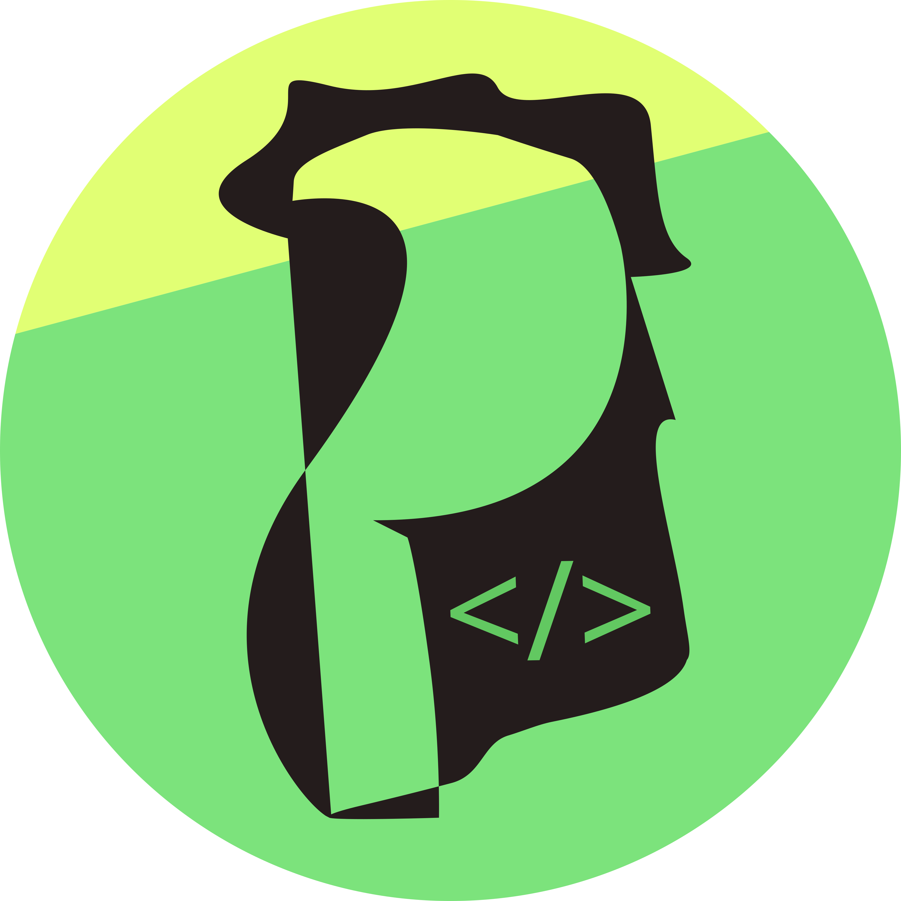
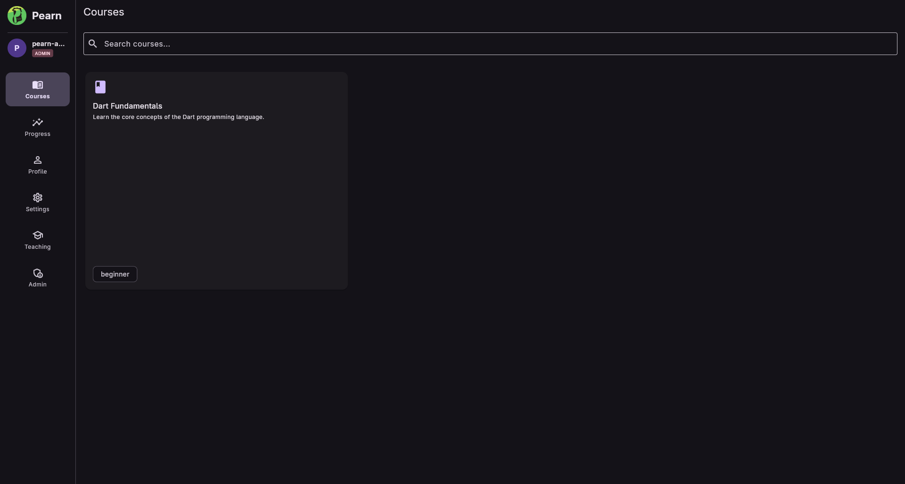
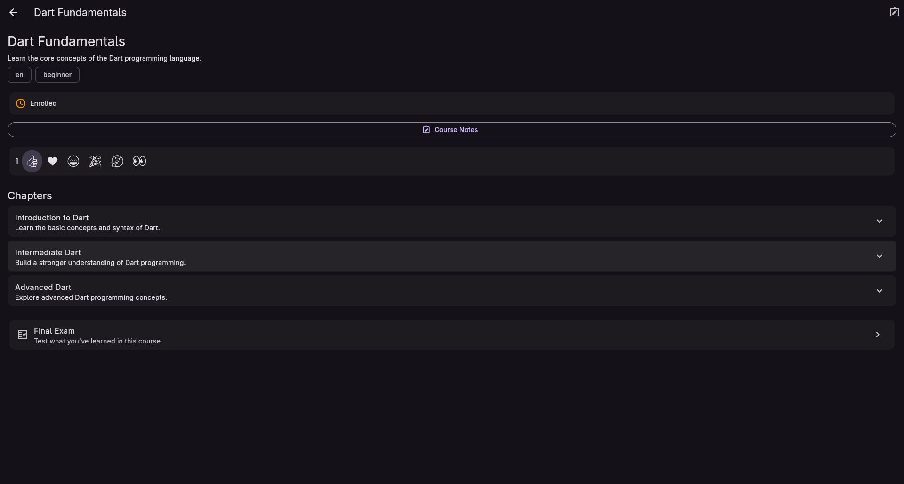
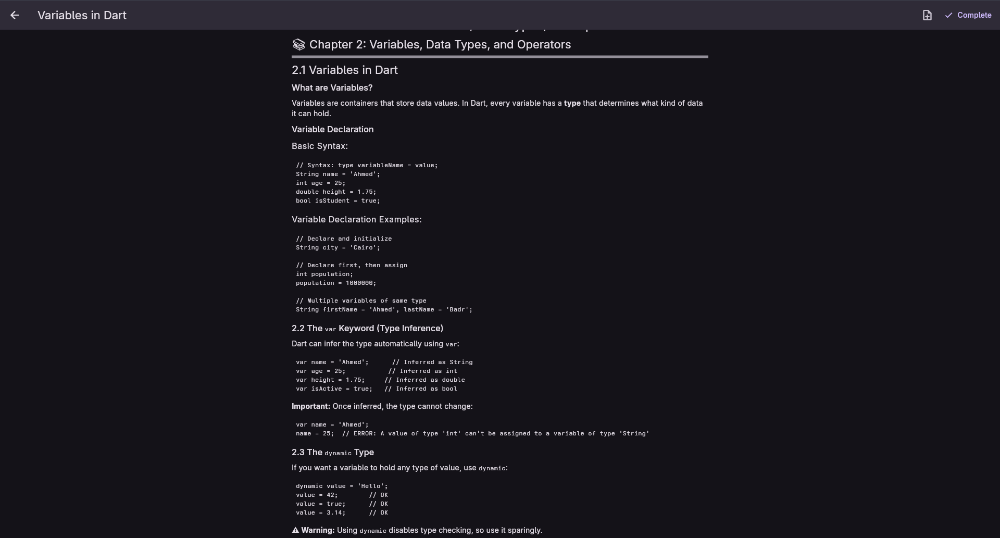
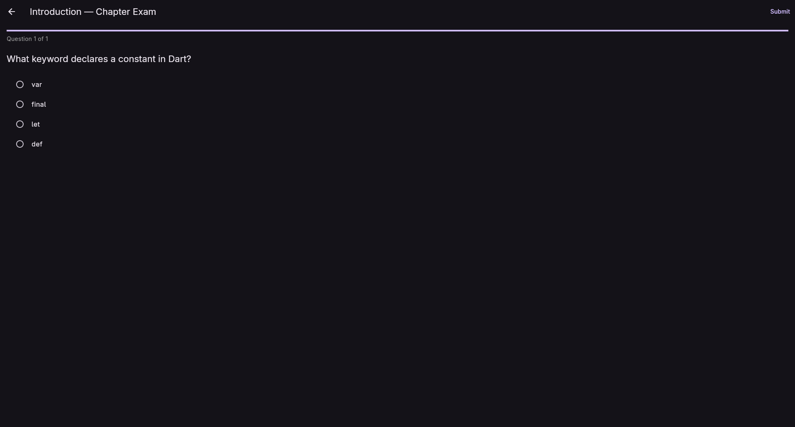
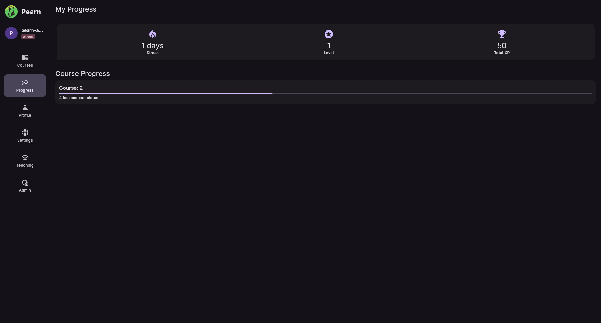
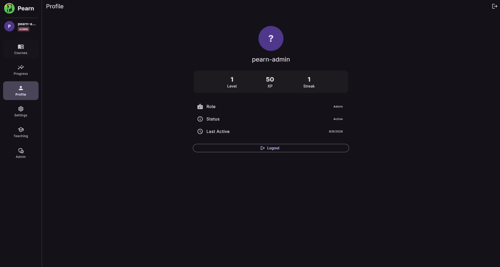
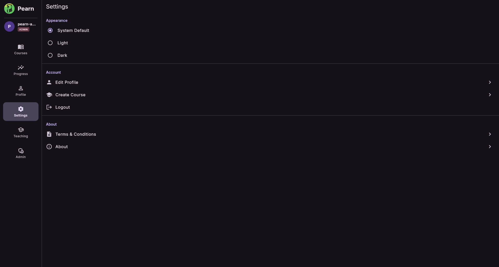
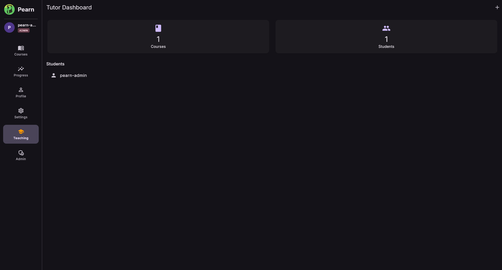
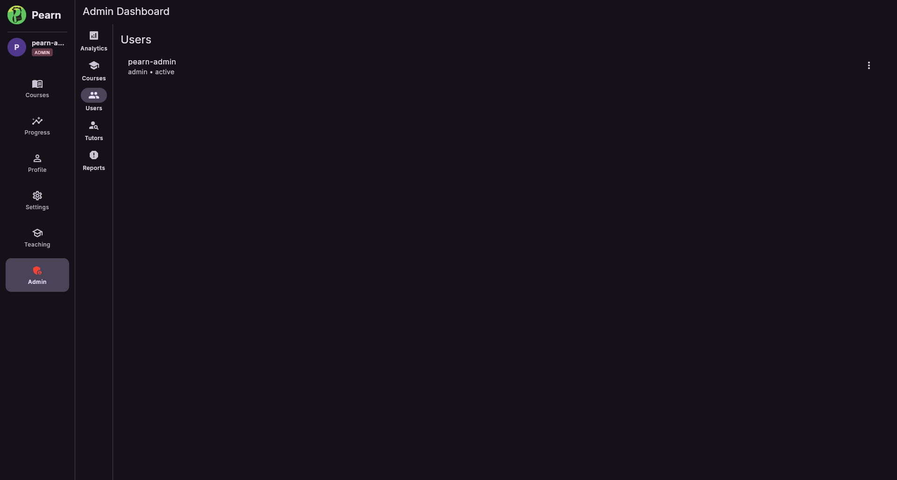

# Pearn

<p align="center">
  
</p>

<h1 align="center">Pearn</h1>

<p align="center">
  <strong>A modern cross-platform programming learning platform built with Flutter.</strong>
</p>

<p align="center">
  Learn programming through structured courses, lessons, exercises, exams, progress tracking, XP, and role-based learning tools.
</p>

<p align="center">
  
  
  
  
  
  
</p>

---

## 📑 Table of Contents

* [About](#-about)
* [Screenshots](#-screenshots)
* [Why Pearn](#-why-pearn)
* [Features](#-features)
* [Platform Support](#-platform-support)
* [Application Architecture](#-application-architecture)
* [Project Structure](#-project-structure)
* [Course Content Architecture](#-course-content-architecture)
* [Data Architecture](#-data-architecture)
* [Authentication & Authorization](#-authentication--authorization)
* [Learning System](#-learning-system)
* [Progress & XP System](#-progress--xp-system)
* [Role System](#-role-system)
* [UI & Responsive Design](#-ui--responsive-design)
* [Technology Stack](#-technology-stack)
* [Getting Started](#-getting-started)
* [Configuration](#-configuration)
* [Development](#-development)
* [Testing](#-testing)
* [Contributing](#-contributing)
* [Roadmap](#-roadmap)
* [Future Improvements](#-future-improvements)
* [Security](#-security)
* [License](#-license)
* [Author](#-author)

---

# 📖 About

**Pearn** is a cross-platform programming education application designed to provide a structured environment for learning programming.

The goal of Pearn is to combine the simplicity of modern learning applications with a structured progression system.

Instead of simply displaying programming articles, Pearn is designed around a complete learning journey:

```text
                    ┌─────────────────┐
                    │      Pearn      │
                    └────────┬────────┘
                             │
                             ▼
                    ┌─────────────────┐
                    │ Choose a Course  │
                    └────────┬────────┘
                             │
                             ▼
                    ┌─────────────────┐
                    │ Learn Lessons    │
                    └────────┬────────┘
                             │
                             ▼
                    ┌─────────────────┐
                    │ Practice        │
                    │ Exercises       │
                    └────────┬────────┘
                             │
                             ▼
                    ┌─────────────────┐
                    │ Take Exams      │
                    └────────┬────────┘
                             │
                             ▼
                    ┌─────────────────┐
                    │ Earn XP         │
                    │ & Progress      │
                    └────────┬────────┘
                             │
                             ▼
                    ┌─────────────────┐
                    │ Unlock Levels   │
                    └─────────────────┘
```

The application is being developed with **Flutter**, allowing the same codebase to target desktop and mobile platforms.

---

# 📸 Screenshots

> Screenshots will be added as the application UI reaches stable milestones.

All screenshots are stored inside:

```text
docs/
└── screenshots/
    ├── login.png
    ├── course-catalog.png
    ├── course-details.png
    ├── lesson.png
    ├── exercise.png
    ├── exam.png
    ├── progress.png
    ├── profile.png
    ├── settings.png
    ├── tutor-dashboard.png
    └── admin-dashboard.png
```

## 🏠 Course Catalog

<p align="center">
  
</p>

The course catalog provides users with a central location for discovering available programming courses.

---

## 📚 Course Learning

<p align="center">
  
</p>

Courses are organized into structured learning content containing chapters, lessons, exercises, and exams.

---

## 📝 Lessons & Exercises

<p align="center">
  
</p>

Lessons provide the educational content while exercises allow users to practice what they have learned.

---

## 🧪 Exams

<p align="center">
  
</p>

Exams are used to evaluate the user's understanding and determine whether they can progress through the course.

---

## 📊 Progress

<p align="center">
  
</p>

The progress system gives users a clear overview of their learning activity and course completion.

---

## 👤 Profile

<p align="center">
  
</p>

Users can manage their profile and view information related to their learning activity.

---

## ⚙️ Settings

<p align="center">
  
</p>

Application preferences and account-related settings are managed from the settings screen.

---

## 👨‍🏫 Tutor Dashboard

<p align="center">
  
</p>

Tutors have access to dedicated tools for managing and monitoring their courses.

---

## 🛡️ Admin Dashboard

<p align="center">
  
</p>

Administrators have access to platform management functionality.

---

# 💡 Why Pearn?

Many programming-learning platforms focus primarily on displaying educational content.

Pearn is designed around **structured progression**.

The learning process is intended to feel more like progressing through a skill tree:

```text
                    Beginner
                       │
                       ▼
                 Introduction
                       │
                       ▼
                   Basics
                       │
                       ▼
                 Intermediate
                       │
                       ▼
                   Advanced
                       │
                       ▼
                   Expert
```

Users are encouraged to:

* Learn
* Practice
* Test their knowledge
* Track their progress
* Earn experience
* Continue progressing

---

# ✨ Features

## 👨‍🎓 Student Features

### Authentication

* Account registration
* Login
* Logout
* Session management
* Google authentication
* User profiles
* Role-based access

### Learning

* Course catalog
* Course enrollment
* Structured chapters
* Lessons
* Exercises
* Exams
* Course completion
* Learning progression

### Progress

* Lesson progress
* Exercise progress
* Exam attempts
* Exam scores
* Course completion
* XP
* Levels
* Learning streaks

### Personalization

* User profile
* Personal notes
* Application settings
* Course reactions

---

# 👨‍🏫 Tutor Features

Tutors have access to dedicated teaching functionality.

Planned and implemented functionality includes:

* Tutor dashboard
* Course management
* Course statistics
* Student overview
* Course content management
* Learning analytics

Tutor functionality is separated from normal student functionality using role-based authorization.

---

# 🛡️ Administrator Features

Administrators have access to platform-level management functionality.

Potential administrative capabilities include:

* User management
* Tutor management
* Course management
* Platform statistics
* Audit logs
* System management
* Administrative dashboards

---

# 💻 Platform Support

Pearn is designed as a cross-platform Flutter application.

| Platform   | Support |
| ---------- | ------- |
| 🐧 Linux   | ✅       |
| 🪟 Windows | ✅       |
| 🤖 Android | ✅       |
| 🍎 iOS     | Planned |
| 🌐 Web     | Planned |

The desktop interface is optimized for larger screens while the mobile interface uses a navigation system designed for touch interaction.

---

# 🏗️ Application Architecture

Pearn uses a layered architecture to keep UI, business logic, repositories, and external services separated.

```text
┌──────────────────────────────────────────────┐
│                  Flutter UI                  │
│                                              │
│ Screens / Views / Widgets / Navigation       │
└───────────────────────┬──────────────────────┘
                        │
                        ▼
┌──────────────────────────────────────────────┐
│                 Presenters                   │
│                                              │
│ Application & Business Logic                 │
└───────────────────────┬──────────────────────┘
                        │
                        ▼
┌──────────────────────────────────────────────┐
│                Repositories                  │
│                                              │
│ Data access & persistence abstraction        │
└───────────────────────┬──────────────────────┘
                        │
             ┌──────────┴──────────┐
             ▼                     ▼
┌──────────────────────┐  ┌──────────────────────┐
│       Supabase       │  │       GitHub         │
│                      │  │                      │
│ Auth / Database      │  │ Course Content       │
│ User Data            │  │ JSON / HTML          │
└──────────────────────┘  └──────────────────────┘
```

This separation makes it possible to replace individual services without rewriting the entire application.

---

# 📂 Project Structure

The project is organized by core functionality and features.

```text
pearn/
│
├── android/
│
├── linux/
│
├── windows/
│
├── lib/
│   │
│   ├── app.dart
│   │
│   ├── core/
│   │   │
│   │   ├── di.dart
│   │   │
│   │   ├── models/
│   │   │   ├── admin.dart
│   │   │   ├── audit_log.dart
│   │   │   ├── category.dart
│   │   │   ├── language.dart
│   │   │   ├── notification.dart
│   │   │   ├── session.dart
│   │   │   ├── sync_record.dart
│   │   │   ├── tutor.dart
│   │   │   └── user.dart
│   │   │
│   │   ├── services/
│   │   │   ├── connectivity_service.dart
│   │   │   ├── github_service.dart
│   │   │   ├── google_auth_service.dart
│   │   │   └── supabase_service.dart
│   │   │
│   │   └── utils/
│   │
│   └── features/
│       │
│       ├── auth/
│       ├── learning/
│       ├── progress/
│       ├── profile/
│       ├── settings/
│       ├── tutor/
│       └── admin/
│
├── docs/
│   └── screenshots/
│
├── test/
│
├── pubspec.yaml
├── analysis_options.yaml
└── README.md
```

---

# 📚 Course Content Architecture

One of the important design decisions in Pearn is separating **course content** from the main application.

Course content can be stored in a dedicated repository and consumed by the Flutter application.

Example:

```text
pearn_courses/
│
├── courses/
│   │
│   ├── rust/
│   │   ├── course.json
│   │   │
│   │   ├── chapters/
│   │   │   │
│   │   │   ├── introduction/
│   │   │   │   ├── lesson.json
│   │   │   │   ├── exercises.json
│   │   │   │   └── exam.json
│   │   │   │
│   │   │   └── ownership/
│   │   │       ├── lesson.json
│   │   │       ├── exercises.json
│   │   │       └── exam.json
│   │   │
│   │   └── assets/
│   │
│   └── python/
│       └── ...
│
└── README.md
```

This architecture allows course authors to update educational content independently of the Flutter application.

---

# 🔄 Course Loading

The general course-loading flow is:

```text
Flutter Application
        │
        ▼
Course Repository
        │
        ▼
GitHub Content Service
        │
        ▼
Public Course Repository
        │
        ▼
Course JSON / HTML
        │
        ▼
Parse Models
        │
        ▼
Display Course
```

Public course content can be delivered through a CDN to reduce unnecessary direct requests to GitHub.

---

# 🗄️ Data Architecture

Pearn uses Supabase/PostgreSQL for application data.

The database is responsible for information such as:

```text
Users
  │
  ├── Profiles
  ├── Roles
  ├── Enrollments
  ├── Progress
  ├── Exam Attempts
  ├── Notes
  ├── Reactions
  └── Notifications
```

Course educational content can remain separate from the database.

This creates a useful separation:

```text
┌─────────────────────┐
│      Supabase       │
│                     │
│ User Data           │
│ Authentication      │
│ Enrollments         │
│ Progress            │
│ XP                  │
│ Notes               │
│ Reactions            │
└──────────┬──────────┘
           │
           │
           │
┌──────────▼──────────┐
│       GitHub        │
│                     │
│ Courses             │
│ Chapters            │
│ Lessons             │
│ Exercises           │
│ Exams               │
│ Course Assets       │
└─────────────────────┘
```

---

# 🔐 Authentication & Authorization

Authentication is handled through Supabase.

After authentication, Pearn retrieves the user's application profile and determines their role.

```text
Login
  │
  ▼
Supabase Authentication
  │
  ▼
Authenticated User
  │
  ▼
User Profile
  │
  ▼
Role
  │
  ├── Student
  │
  ├── Tutor
  │
  └── Admin
```

The application then exposes the appropriate functionality.

---

# 🎓 Learning System

A course follows a hierarchical structure.

```text
Course
│
├── Chapter
│   │
│   ├── Lesson
│   │
│   ├── Exercises
│   │
│   └── Exam
│
├── Chapter
│   │
│   ├── Lesson
│   ├── Exercises
│   └── Exam
│
└── ...
```

A typical learning path is:

```text
Course
   ↓
Chapter
   ↓
Lesson
   ↓
Exercise
   ↓
Exam
   ↓
Progress
   ↓
Next Chapter / Level
```

---

# 🏆 Progress & XP System

Pearn uses a progression system to encourage consistent learning.

Users can gain XP through activities such as:

* Completing lessons
* Completing exercises
* Passing exams
* Completing courses

The general concept is:

```text
Learning Activity
       │
       ▼
    XP Earned
       │
       ▼
    XP Total
       │
       ▼
    User Level
       │
       ▼
   Progression
```

This system can later be expanded with achievements, badges, leaderboards, and milestones.

---

# 👥 Role System

Pearn currently defines three primary application roles.

| Role      | Description                      |
| --------- | -------------------------------- |
| `student` | Learns and tracks progress       |
| `tutor`   | Creates/manages learning content |
| `admin`   | Manages the platform             |

Example:

```text
                    User
                      │
             ┌────────┼────────┐
             │        │        │
             ▼        ▼        ▼
          Student   Tutor     Admin
             │        │        │
             ▼        ▼        ▼
          Learning  Teaching  Management
```

---

# 🎨 UI & Responsive Design

Pearn is designed to provide different navigation experiences depending on screen size.

## Mobile

Mobile devices use a bottom navigation bar.

```text
┌─────────────────────────────┐
│                             │
│         Page Content        │
│                             │
│                             │
├─────────────────────────────┤
│ 📚      📊      👤      ⚙️  │
│Courses Progress Profile Settings
└─────────────────────────────┘
```

## Desktop

Desktop platforms use a sidebar.

```text
┌────────────────┬──────────────────────────┐
│                │                          │
│     Pearn      │                          │
│                │                          │
│    📚 Courses  │                          │
│    📊 Progress │       Page Content       │
│    👤 Profile  │                          │
│    ⚙ Settings  │                          │
│                │                          │
│    🎓 Teaching │                          │
│    🛡 Admin    │                          │
│                │                          │
└────────────────┴──────────────────────────┘
```

Role-specific navigation is displayed only when the user has the appropriate permissions.

---

# 🧰 Technology Stack

## Frontend

### Flutter

Flutter provides the cross-platform UI framework.

### Dart

Dart is used for application logic and Flutter development.

---

## Backend

### Supabase

Used for:

* Authentication
* PostgreSQL database
* User data
* Enrollments
* Progress
* Application state

---

## Course Infrastructure

### GitHub

Used for maintaining public course content.

### CDN

Public course content can be served through a CDN to improve performance and reduce direct repository requests.

---

## Local Storage

Local storage and caching are used to improve application responsiveness and support offline-friendly functionality where appropriate.

---

# 📦 Dependencies

Major dependencies used by the project include:

```text
Flutter
Dio
Supabase Flutter
Hive
GetIt
UUID
Google Sign-In
```

The exact dependency versions can be found in:

```text
pubspec.yaml
```

---

# 🚀 Getting Started

## 1. Clone the Repository

```bash
git clone https://github.com/YOUR_USERNAME/pearn.git
cd pearn
```

---

## 2. Check Flutter

```bash
flutter doctor
```

Make sure the required platform toolchains are installed.

---

## 3. Install Dependencies

```bash
flutter pub get
```

---

## 4. Configure Supabase

Create a Supabase project and configure the application with the required public client configuration.

The application requires authentication and database access for user-related functionality.

**Never place a Supabase service-role key inside the Flutter application.**

---

## 5. Configure Google Authentication

If Google authentication is enabled, configure the required Google OAuth credentials for the target platforms.

---

## 6. Run Pearn

Check available devices:

```bash
flutter devices
```

Run normally:

```bash
flutter run
```

### Linux

```bash
flutter run -d linux
```

### Windows

```bash
flutter run -d windows
```

### Android

```bash
flutter run -d android
```

---

# ⚙️ Configuration

Before running a complete development environment, configure:

```text
Supabase
├── Project URL
├── Public client key
└── Database schema

Google Authentication
├── OAuth configuration
└── Platform configuration

Course Repository
├── Repository location
└── Course content structure
```

Sensitive credentials should never be committed to Git.

---

# 🧪 Development

During development, the following commands are useful.

## Analyze

```bash
flutter analyze
```

## Format

```bash
dart format .
```

## Test

```bash
flutter test
```

## Run

```bash
flutter run
```

## Build Linux

```bash
flutter build linux
```

## Build Windows

```bash
flutter build windows
```

## Build Android

```bash
flutter build apk
```

---

# 🧪 Testing Strategy

Pearn is intended to use multiple levels of testing.

```text
                Testing
                   │
        ┌──────────┼──────────┐
        │          │          │
        ▼          ▼          ▼
      Unit       Widget    Integration
      Tests      Tests       Tests
        │          │          │
        ▼          ▼          ▼
    Business       UI       Complete
      Logic      Components   Flows
```

Areas that should be tested include:

* Authentication
* Repository behavior
* Course parsing
* Progress calculation
* Exam scoring
* XP calculation
* Role permissions
* Navigation
* Database operations

---

# 🧑‍💻 Development Workflow

A typical development workflow:

```text
Issue
  │
  ▼
Create Branch
  │
  ▼
Implement Feature
  │
  ▼
Format Code
  │
  ▼
Run Analyzer
  │
  ▼
Run Tests
  │
  ▼
Commit
  │
  ▼
Push
  │
  ▼
Pull Request
```

Example:

```bash
git checkout -b feature/course-progress
```

Then:

```bash
dart format .
flutter analyze
flutter test
```

Commit:

```bash
git add .
git commit -m "Add course progress tracking"
```

Push:

```bash
git push origin feature/course-progress
```

---

# 🤝 Contributing

Contributions are welcome.

Before submitting a pull request:

1. Create a dedicated branch.
2. Keep changes focused.
3. Follow the existing project architecture.
4. Format Dart code.
5. Run `flutter analyze`.
6. Run available tests.
7. Explain the changes in the pull request.

For larger architectural changes, open an issue first so the proposed approach can be discussed.

---

# 🗺️ Roadmap

## Foundation

* [x] Flutter application
* [x] Cross-platform project structure
* [x] Dependency injection
* [x] Core models
* [x] Service layer
* [x] Repository architecture
* [x] Responsive navigation

## Authentication

* [x] Authentication architecture
* [x] User profiles
* [x] Role system
* [x] Session handling
* [ ] Complete Google authentication flow

## Learning

* [x] Course catalog
* [x] Course models
* [x] Lesson architecture
* [x] Exercise architecture
* [x] Exam architecture
* [x] GitHub course-content architecture
* [ ] Expand course management
* [ ] More programming languages

## Progress

* [x] Progress architecture
* [x] Enrollment architecture
* [x] Exam attempts
* [ ] Complete XP system
* [ ] Achievements
* [ ] Badges
* [ ] Learning streak improvements
* [ ] Advanced analytics

## Tutor

* [x] Tutor role
* [x] Tutor dashboard foundation
* [ ] Complete course management
* [ ] Student analytics
* [ ] Course statistics
* [ ] Content publishing workflow

## Administration

* [x] Admin role
* [x] Admin dashboard foundation
* [ ] User management
* [ ] Tutor management
* [ ] Course management
* [ ] Audit tools
* [ ] Platform analytics

## Platform

* [x] Linux support
* [x] Windows support
* [x] Android support
* [ ] iOS support
* [ ] Web support

---

# 🔮 Future Improvements

Possible future additions include:

### 🏅 Gamification

* Achievements
* Badges
* Leaderboards
* Daily challenges
* XP rewards
* Course milestones

### 🌐 Community

* Learning roadmaps
* Community interaction
* Course reactions
* User achievements
* Shared learning progress

### 📊 Analytics

* Learning statistics
* Course completion analytics
* Exam performance
* Learning time
* Streak statistics

### 📱 Offline Learning

* Downloadable lessons
* Offline exercises
* Local progress synchronization
* Background synchronization

### 🌍 More Languages

Potential future courses include:

```text
Rust
Python
C
C++
Java
JavaScript
TypeScript
SQL
HTML / CSS
```

---

# 🔒 Security

Security is an important part of the project.

Never commit:

```text
.env
API secrets
Service-role keys
Database passwords
Private OAuth credentials
Private GitHub tokens
Signing keys
```

Client applications should only contain credentials that are explicitly safe for client-side use.

Server-side or privileged credentials must remain outside the Flutter application.

---

# 📜 License

The project license has not yet been finalized.

A license should be added before distributing the project publicly.

Possible choices include:

* MIT
* Apache 2.0
* GPL-3.0


---

# ⭐ Project Status

> 🚧 **Pearn is currently under active development.**

The architecture and features are still evolving.

Some features shown in the documentation may be partially implemented or under development.

The project is being developed as a practical full-stack learning platform and as an exploration of scalable Flutter application architecture.

---

# 📬 Feedback

If you find a bug, have a feature request, or have an architectural suggestion, please open an issue.

When reporting a bug, include:

```text
Flutter version:
Dart version:
Operating system:
Device:
Steps to reproduce:
Expected behavior:
Actual behavior:
Error/log:
```

---

# ❤️ Pearn

<p align="center">
  
</p>

<p align="center">
  <strong>Learn. Practice. Progress.</strong>
</p>

<p align="center">
  Built with Flutter and ❤️ for programming education.
</p>
